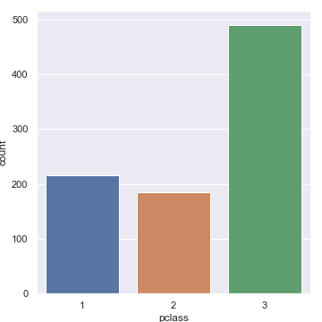
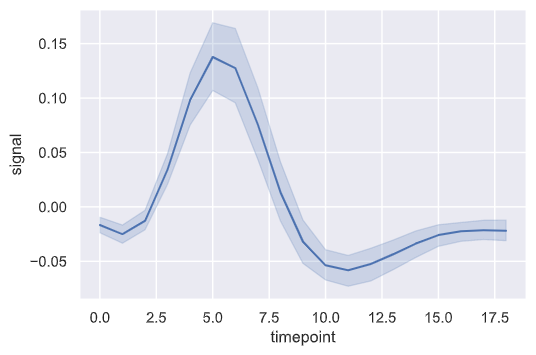
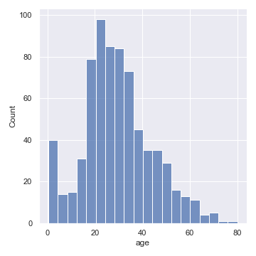
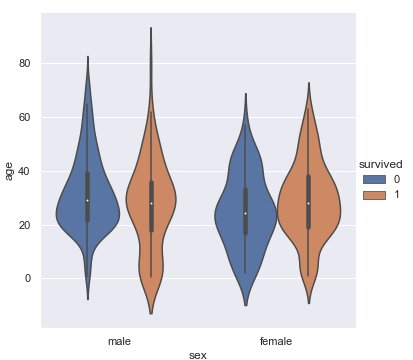
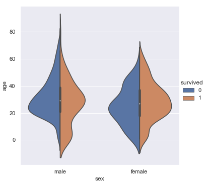
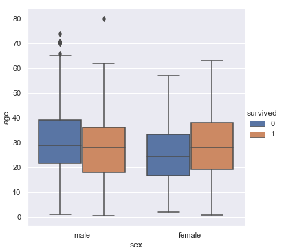
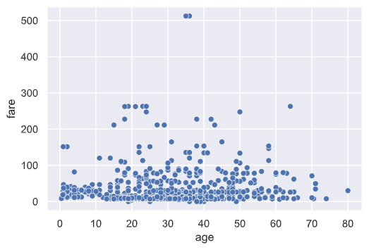
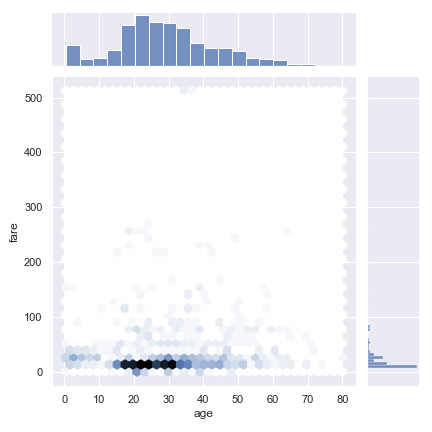
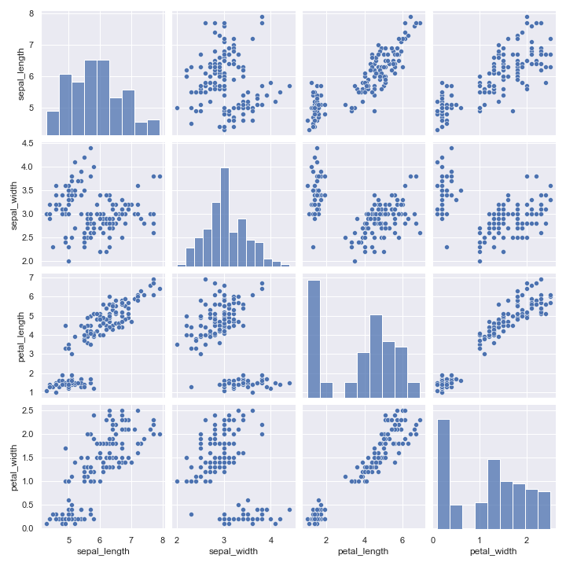

参考：[seaborn 徹底入門！Pythonを使って手軽で綺麗なデータ可視化８連発](https://www.codexa.net/seaborn-python/)

## imports
```py
import pandas as pd
pd.plotting.register_matplotlib_converters()
import matplotlib.pyplot as plt
%matplotlib inline
import seaborn as sns
```

## snsのサンプルデータを取得
```py
tips = sns.load_dataset('tips')
df = sns.load_dataset('titanic')
df2 = sns.load_dataset('iris')
```

## 縦棒グラフ


- `hue`：指定したカテゴリ値ごとに棒グラフを横に並べる（色分け）

### x,yを直接指定

```py
sns.barplot(x, y)
```

### カテゴリ値のカウント値グラフ

```py
sns.countplot(x="pclass", data=df)
```

```py
sns.catplot(x="pclass", data=df, kind="count")
```

### 平均値の棒グラフ
- catplotで`kind='bar'`を指定すると平均値の比較になる
- 誤差範囲（error bar）も表示される
  - デフォルトでは95%信頼区間(標準偏差*2)

```py
sns.catplot(x='sex', y='age', data=df, kind='bar', hue='survived')
```

※横棒グラフにしたい場合はyを指定する

## 推移確認
### 折れ線グラフ



```py
sns.lineplot(x="timepoint", y="signal", data=fmri)
```

## 分布確認
### ヒストグラム



```py
sns.displot(df['age'], hist=True)
```

## バイオリンプロット



```py
sns.catplot(x='sex', y='age', data=df, kind='violin', hue='survived')
```

### ラベルごとの分布を結合



```py
sns.catplot(x='sex', y='age', data=df, kind='violin', hue='survived', split=True)
```

## 箱ひげ図



```py
sns.catplot(x='sex', y='age', data=df, kind='box', hue='survived')
```

## 散布図



```py
sns.scatterplot(x='age', y='fare', data=df)
```

### 散布図の上と右に、各変量のヒストグラムを併せて表示する



```py
sns.jointplot(x='age', y='fare', data=df, kind='hex')
```

### 全ての２変数の組み合わせで散布図を表示



```py
sns.pairplot(df2)
```
