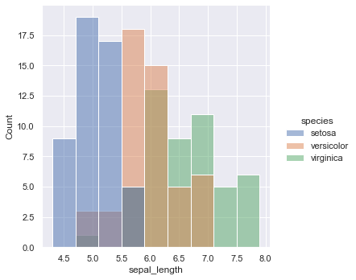
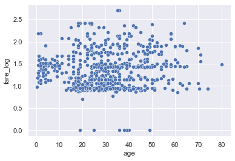

## snsのサンプルデータを取得
```py
import seaborn as sns
tips = sns.load_dataset('tips')
df = sns.load_dataset('titanic')
df2 = sns.load_dataset('iris')
```

## 列情報の確認
```py
df.info()
```

```
<class 'pandas.core.frame.DataFrame'>
RangeIndex: 891 entries, 0 to 890
Data columns (total 15 columns):
 #   Column       Non-Null Count  Dtype   
---  ------       --------------  -----   
 0   survived     891 non-null    int64   
 1   pclass       891 non-null    int64   
 2   sex          891 non-null    object  
 3   age          714 non-null    float64 
 4   sibsp        891 non-null    int64   
 5   parch        891 non-null    int64   
 6   fare         891 non-null    float64 
 7   embarked     889 non-null    object  
 8   class        891 non-null    category
 9   who          891 non-null    object  
 10  adult_male   891 non-null    bool    
 11  deck         203 non-null    category
 12  embark_town  889 non-null    object  
 13  alive        891 non-null    object  
 14  alone        891 non-null    bool    
dtypes: bool(2), category(2), float64(2), int64(4), object(5)
memory usage: 80.7+ KB
```

### Non-Null Count
- deckはNon-Null Countが少ないため、あまり有効な情報としては使えない可能性がある

### 列ごとの意味を確認
- 列の型だけでは判断できないため、ひとつづつ確認する必要がある
  - カテゴリ値
    - カテゴリのID、Code
    - カテゴリの名前
    - フラグ
  - 数値
  - その他
    - 文章
    - 画像
    - バイナリ

## カテゴリ値の分析
- 注意点
  - IDやCodeを表す数値の場合、数値自体を比較しても意味がないため注意する
    - 値の大小に意味はないということ

### カテゴリ値の前処理
- 基本的には必要ないことが多い
- 名称のほうがわかりやすい場合はカテゴリ値（名称）に置換してしまう
- 正規化されていない場合や複数のカテゴリをまとめる場合も置換をかける

### 分析（単体）
カテゴリ値別のカウント・割合を見る

```py
target = df.pclass
pd.concat([target.value_counts(), target.value_counts(normalize=True)], axis=1)
```

- | pclass | pclass
-- | -- | ---
3 | 491 | 0.551066
1	| 216	| 0.242424
2	| 184	| 0.206510

カテゴリ値が多すぎるときは、カウントが少ないものを除外したりまとめたりするとわかりやすくなる

### 分析（複数）
カテゴリ値 × カテゴリ値はクロス集計

```py
pd.crosstab(df.pclass, df.survived, margins=True, normalize='all')
```

survived | 0 | 1 | All
-- | -- | -- | --
pclass | - | - | 
1 | 0.089787 | 0.152637 | 0.242424
2 | 0.108866 | 0.097643 | 0.206510
3 | 0.417508 | 0.133558 | 0.551066
All | 0.616162 | 0.383838 | 1.000000

カテゴリ値 × 数値：カテゴリ値ごとの分布の形確認

```py
sns.displot(data=df2, x='sepal_length', hue='species')
```



カテゴリ数が多いなら、ひとつづつ見るとか上位だけにするとか。。

```py
for specie in df2.species.unique():
  grid = sns.displot(df2.query('species==@specie').sepal_length)
  grid.fig.suptitle(specie)
```

## 数値の分析
- 数値は分布を可視化できるため、分析の幅が広い
  - 離散化でカテゴリ値としての分析もできる
- 注意点
  - 分布によってはそのままの値だと比較しにくいときがあるので注意する

### 分析（単体）
数値の分布を確認する

```py
sns.displot(df.age)
```


### 分析（複数）
- 数値 × 数値
  - 散布図で相関関係を確認
  - 離散化してカテゴリ値として分析する
  - 分布の形があまりにも違う、偏っている場合
    - 分布の形を調整する：対数変換（裾が重いとき）
    - 分布の範囲を調整する：正規化（分布の範囲がバラバラな時）

普通に散布図で見る

```py
sns.scatterplot(x='age', y='fare', data=df)
```


これだとfareの分布が偏りすぎててよくわからないので、対数変換してみる

```py
import numpy as np
df['fare_log'] = np.log10(df.fare + 1)
sns.scatterplot(x='age', y='fare_log', data=df)
```



相関とかはなさそう。

## その他
- 文章や画像のバイナリ値など
- そのままでは分析データとして扱えないため、別途加工が必要

