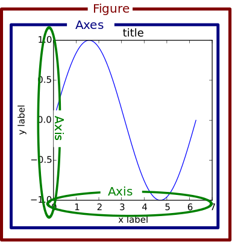

標準的な可視化のライブラリ
ちょっと設定がめんどくさかったりするが、細かい設定ができる

参考：
- [早く知っておきたかったmatplotlibの基礎知識、あるいは見た目の調整が捗るArtistの話](https://qiita.com/skotaro/items/08dc0b8c5704c94eafb9)
- [matplotlibのめっちゃまとめ](https://qiita.com/nkay/items/d1eb91e33b9d6469ef51)

## 構造



参考：[公式サイト](https://matplotlib.org/1.5.1/faq/usage_faq.html)

## imports
```py
pd.plotting.register_matplotlib_converters()
import matplotlib.pyplot as plt
%matplotlib inline
```

- `pd.plotting.register_matplotlib_converters()`：pandas型変換
- `%matplotlib inline`：Notebookでインラインに画像表示

## 定義

### figとaxを一気に作る
```py
fig, ax = plt.subplots()
ax.plot(x,y)
```

### 複数グラフ
```py
fig = plt.figure()
fig,(ax1,ax2)=plt.subplots(1,2,figsize=(10,5))
ax.plot(x, y)
```

## レイアウト

### Figureオブジェクト

項目 | 内容 | 備考
--- | --- | ---
グラフ縦横比率 | `plt.figure(figsize=(16,6))` | 
外枠の太さ | `fig.set_linewidth(1)` | デフォルトは0（なし）
タイトル | `fig.suptitle('タイトル')` |

### Axesオブジェクト

項目 | 内容 | 備考
--- | --- | ---
タイトル | `ax.set_title('タイトル')` |
軸ラベル | `ax.set_ylabel('横軸ラベル名', fontsize=14)` |
軸最小値・最大値 | `as.set_ylim(bottom, top)` |
軸メモリ幅 | `ax.yaxis.set_major_locator(mpl.ticker.MultipleLocator(0.2))` |
対数メモリ | `ax.set_yscale('log')` | 
メモリをパーセント表記に変換 | `ax.xaxis.set_major_formatter(mpl.ticker.PercentFormatter(1))` |
メモリのフォントサイズ | `ax.tick_params(labelsize=14)` |

## 凡例の設定

凡例は`Figure.legend()`あるいは`Axes.legend()`を用いる。このときパラメータを入力すると凡例の設定ができる。

項目 | 説明 | 備考
--- | --- | ---
labels | 凡例のラベル名リスト | 
loc | 凡例の位置
bbox_to_inches | 凡例の位置と大きさ
ncol | 凡例の列数。デフォルトは1。
fontsize | 凡例のフォントサイズ。

### 凡例の位置設定
引数locに特定の文字列または数値を渡すことで凡例の位置を指定できる。

文字列 | 数字 | 説明
--- | --- | ---
'best' | 0 | 以下から自動で位置を決定
'upper right' | 1 | 右上
'upper left' | 2 | 左上
'lower left' | 3 | 右下
'lower right' | 4 | 左下
'right' | 5 | 右中央
'center left' | 6 | 左中央
'center right' | 7 | 右中央
'lower center' | 8 | 中央下
'upper center' | 9 | 中央上
'center' | 10 | 中央

'center right'と'right'は同じ。
左下を(0, 0)・右上を(1, 1)とする座標を(float, float)の形で渡すことで、凡例左下隅の位置を任意に指定可能。

### 凡例の位置と大きさを細かく設定
引数bbox_to_inchesに、左下を(0, 0)・右上を(1, 1)とする座標を(float, float)の形で渡すことで、locで指定した凡例の隅がその位置にくる。
また、横位置・縦位置に続けて幅・高さを加えた(float, float, float, float)の形にすることで、大きさを指定することもできる。

mode引数のデフォルトはNoneになっている。これがNoneのとき、凡例の横幅は表示文字列に合わせて自動調整される。
mode='expand'とすることで、内容にかかわらず凡例の幅をbbox_to_inchesで指定した値にすることができる。

## 画像保存
```py
fig.savefig("img.png")
```